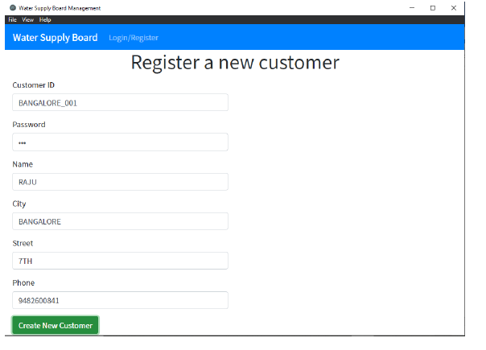
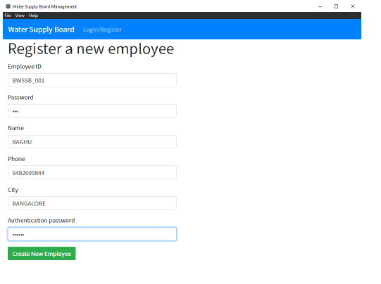
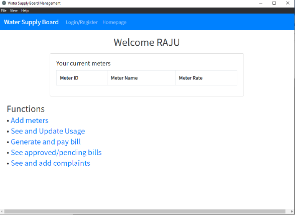
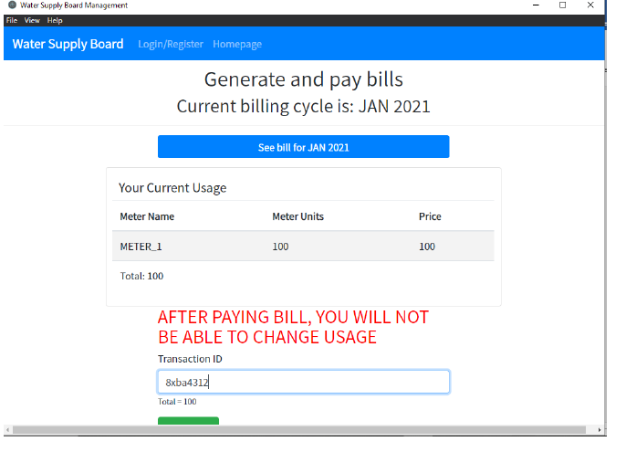
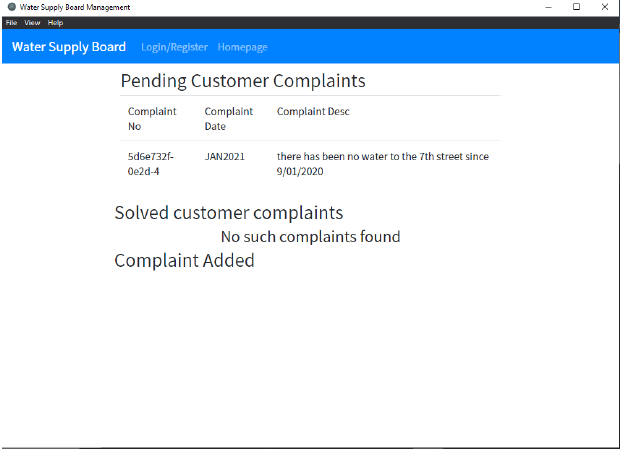
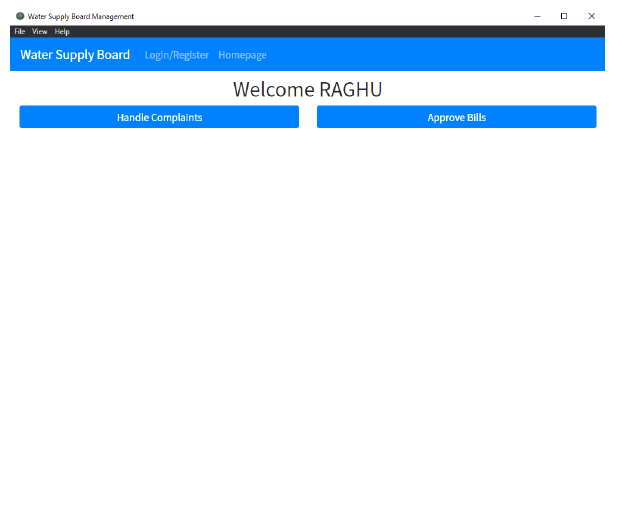
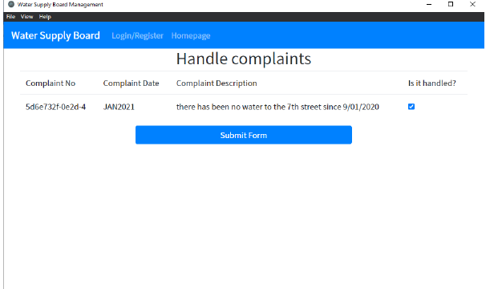

# Water Supply Board Management System

## Overview

This is a desktop application which simulates the water supply board of a city. It allows both customers and employees to register and log in.
Customers can add water meters, update the usage, pay bills, and raise complaints.
Employees can view customers' bills, approve them, and handle complaints.

The benefit is that all this can be done through a single application. Most of the work can be done through 
an application instead of going to the office.

## Technology used

* ReactJS
* ElectronJS for the desktop application 
* Oracle DBMS and Oracle Node JS driver
* Bootstrap for the UI 

Programming language used: Typescript, for front end and back end

## Usage

### Customer register page

### Employee register page

### Customer homepage 

### Customer bill payment 

### Customer complaint page 

### Employee homepage

### Employee handling complaints

